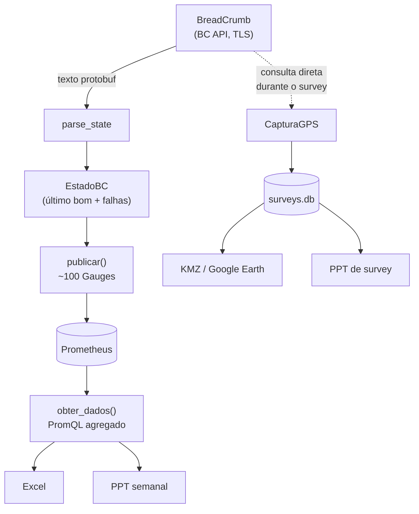
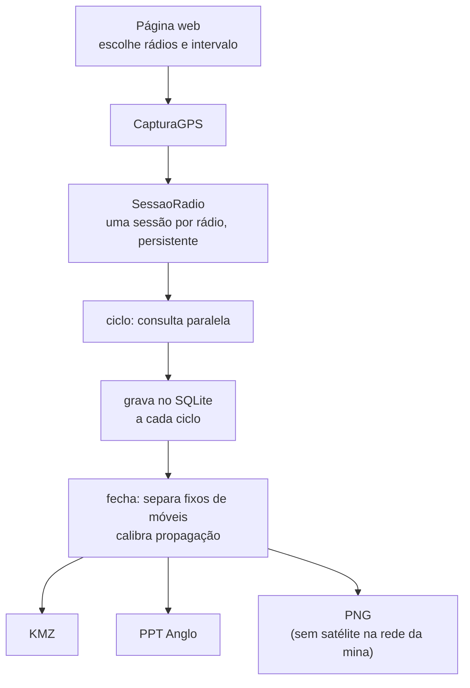

# Arquitetura

Como o `rajant_monitor.py` funciona por dentro: o caminho que um dado
percorre do rádio até o slide, e por que cada peça está onde está.

Para *usar* o programa, leia o [README](README.md). Este documento é para
quem vai **mexer** nele.

---

## 1. O que é

Um processo que faz três coisas ao mesmo tempo, sobre a mesma coleta:

| papel | saída |
|---|---|
| **Exportador Prometheus** | ~100 famílias de métrica em `/metrics` |
| **Gerador de relatórios** | Excel e PowerPoint, semanal e de survey |
| **Ferramenta de site survey** | captura ao vivo, KMZ para Google Earth, PPT próprio |

São ~13 mil linhas num arquivo só, e isso é deliberado.

### Por que um arquivo só

A rede da mina é isolada: sem PyPI, sem Docker, sem pipeline de deploy. O
que roda lá chega por pendrive ou por cópia de arquivo. Um pacote com
`__init__.py`, dependências internas e ordem de importação é mais uma
coisa para dar errado no lugar onde ninguém pode depurar.

Um arquivo tem custo real — navegar nele é pior, e o acoplamento é fácil
demais. O que segura isso é a suíte de testes (362) e as âncoras de seção
descritas em §9.

**Dependências:** `prometheus_client`, `python-pptx`, `openpyxl`,
`matplotlib`, `numpy`, `scipy`, `lxml`, e a `rajant-api` para falar com os
rádios. Nada de framework web: o servidor é `http.server` da biblioteca
padrão.

---

## 2. O caminho do dado



Repare que há **dois caminhos de leitura do rádio**, e eles não se
misturam:

- O **coletor** roda em ciclo fixo, publica em métricas e alimenta os
  relatórios pelo Prometheus. É a série histórica.
- A **captura de survey** fala com os rádios *diretamente*, na hora, e
  grava no SQLite. Amostrar o cache do exportador daria a resolução do
  ciclo do exportador, não a que o survey pediu.

Quando a consulta direta falha, a amostra cai para o último estado do
exportador e é **marcada como tal** (`fonte = 'cache'`). Ponto defasado e
identificado é melhor que buraco no trajeto; ponto defasado disfarçado de
medição é pior que os dois.

---

## 3. Camada por camada

### 3.1 Transporte e parsing

A `rajant-api` devolve o `State` em **texto de protobuf**, não em objeto.
O parsing é por regex, com um detalhe que não é opcional:

`extrair_blocos()` **conta chaves**. Regex não equilibra `{}`, e os blocos
do State aninham — um `peer` dentro de `radio` dentro de `wireless`.
Extrair com regex ingênua pega o fechamento errado e mistura campos de
níveis diferentes.

> `parse_state()` é a fronteira: dali para dentro tudo é dicionário
> Python. Nenhuma outra parte do programa sabe que existe protobuf.

**Compatibilidade:** a `rajant-api` 0.1.1 faz `from ssl import
wrap_socket`, removida no Python 3.12. O módulo instala um *shim* antes de
importá-la — por isso `import rajant_api` sozinho falha e
`import rajant_monitor` funciona.

**Filtro de estado:** `_get_state_filtrado()` pede só os ramos `gps`,
`wireless` e `system`. O nome do parâmetro mudou entre versões da
biblioteca, então ele é **descoberto por `inspect.signature`** na primeira
chamada, nunca assumido. Sem filtro disponível, cai para o State inteiro —
mais pesado, porém correto.

### 3.2 Estado e confiabilidade

Três classes guardam o que uma leitura isolada não sabe:

| classe | o que resolve |
|---|---|
| `EstadoBC` | último dado bom + falhas consecutivas. Um BC não fica offline no primeiro timeout. |
| `JanelaDisponibilidade` | janelas deslizantes de 1 h / 24 h / 7 d, metodologia BCE |
| `CacheIPs` | IPs já descobertos, em disco, para sobreviver a reinício com seed fora |

`EstadoBC` existe porque a malha tem perda: sem ele, o painel piscaria a
cada varredura. `manter_s` define por quanto tempo o último dado bom ainda
vale.

### 3.3 Descoberta e coleta

O `RajantCollector` parte dos *seeds* e caminha pelos peers. Cada ciclo
dispara uma thread por BC, limitadas por semáforo (`max_threads`).

Duas armadilhas resolvidas aqui:

**Nó físico ≠ IP.** Um BC com quatro rádios responde em quatro IPs.
`_publicar_identidade()` agrupa por identidade reportada — `system.ipv4`
primeiro, nome depois, IP consultado por último. Sem isso, 150 BCs viram
600 na contagem. E há guarda: grupo com mais de 6 interfaces sugere colisão
de nome, não nó com muitos rádios; nesse caso desagrupa.

**Lista fechada é fechada.** Com `descoberta = false`, o ciclo **não pode**
reintroduzir peers pela porta dos fundos. É uma linha de código (`if peers
and self.descoberta`) e sem ela a configuração seria decorativa.

### 3.4 Publicação

`publicar()` escreve nos Gauges. A regra que governa tudo aqui:

> **Nunca publicar 0 no lugar de "não medi".** Zero é indistinguível de
> "medido e deu zero". Campo sem medição vira `None` e a série é **omitida**.

Isso parece detalhe e não é: era o que fazia contador de erro de ethernet e
CPU parecerem saudáveis num painel inteiro.

### 3.5 Relatórios

`obter_dados()` consulta o Prometheus (`query_range`, `group_left` para
juntar rótulos) e devolve uma estrutura única que alimenta Excel e PPT.
Os dois formatos leem **a mesma** estrutura — divergir aqui produziria um
Excel e um PPT que discordam sobre a mesma semana.

---

## 4. Modelo de execução


Tudo é *thread*, nada é `async`. A carga é I/O de rede com timeout, e
`threading` com semáforo resolve isso sem contaminar o resto do código com
`await`.

**Coleta acelerada dos móveis.** `intervalo_moveis_segundos` roda um ciclo
curto só com os equipamentos móveis. Veículo muda de posição e de servidor
o tempo todo; torre, não.

**O teto de threads não é sobre o servidor.** 150 conexões simultâneas
derrubam a malha antes de derrubar o processo. O gargalo protegido é o
rádio, não a CPU.

---

## 5. Armazenamento

Três lugares, com propósitos distintos:

| onde | o quê | por quê |
|---|---|---|
| **Prometheus** | série temporal das métricas | histórico, alertas, Grafana |
| **`surveys.db`** (SQLite) | surveys, amostras, medições manuais | o survey precisa da amostra crua, não do agregado |
| **`cache_ips.json`** | IPs já vistos | sobreviver a reinício com seed fora do ar |

### Esquema

```
survey       id, nome, inicio, fim, intervalo_s, radios(JSON), alcance,
             n_amostras, n_moveis, n_fixos, intervalo_efetivo_s,
             resumo(JSON), calibracao(JSON), criado_em

amostra      survey_id, radio, ts, lat, lon, vel,
             snr, sinal, ruido, rtt, perda, custo, taxa, vazao,
             peers, sats, hdop, banda,
             fonte, servidor, interf, canal

medicao_manual  id, survey_id, tipo('iperf'|'trace'), data, local, lat, lon, …
```

Dois campos merecem explicação:

- **`intervalo_efetivo_s`** — o intervalo *pedido* é intenção; o ciclo pode
  estourá-lo. O que descreve a resolução do trajeto é o que de fato
  aconteceu, e é esse que vai para o relatório.
- **`servidor`** — qual BC atendeu naquele ponto. Sem ele não dá para dizer
  *"esta área é servida pelo ERB-03"*, que é a frase que o survey existe
  para produzir, nem para detectar handover e ping-pong.

Migração de banco antigo é feita com `ALTER TABLE` condicional na abertura:
`CREATE TABLE IF NOT EXISTS` não acrescenta coluna a tabela que já existe.

---

## 6. O subsistema de survey



**`SessaoRadio`** mantém a conexão autenticada aberta entre ciclos.
Reautenticar a cada leitura, num intervalo curto, custa mais que a leitura.
Rádio que falha N vezes seguidas é abandonado pelo resto do survey — um
rádio morto não pode segurar o ciclo dos outros.

**Fixo × móvel sai do dado, não do nome.** No fechamento, quem não se
deslocou mais que ~30 m vira "fixo". Um ERM rebocado é rota, e é isso que
importa.

**Calibração de propagação.** Com as posições dos fixos e o RSSI medido,
ajusta `RSSI = A − 10·n·log10(d)` por banda. Serve para estimar alcance —
e a estimativa **nunca** é desenhada junto com a medição sem distinção
visual (§8).

### O mapa de calor

A rota sai como **raster georreferenciado** (`GroundOverlay`), não como
linha. Cada amostra pinta um núcleo de raio limitado à sua volta; fora
dele, transparente.

Isso **não** é superfície de cobertura. Cobertura interpola valor sobre
terreno onde ninguém passou — afirma sinal em lugar não medido. Há teste
exigindo que a maior parte do raster continue transparente.

Três decisões que custaram depuração, todas visíveis no Google Earth antes
de serem entendidas:

1. **Só entra quem andou.** Rádio parado dá dezenas de amostras no mesmo
   ponto: virava bola isolada e, como BC fixo enxerga o vizinho de perto,
   saía verde. Eram as "bolas desconectadas" — e o verde que não batia com
   a realidade da mina.
2. **Opacidade pelo núcleo mais forte, não pela soma.** Pela soma, a pilha
   de amostras de um equipamento parado ficava sólida *e* puxava a
   referência de opacidade para cima, apagando o rastro de quem andou.
3. **Raio acompanha o espaçamento.** Raio menor que o vão entre amostras
   não conecta os núcleos: vira colar de contas.

> **Limite físico, não de desenho:** com amostras a 200 m não existe faixa
> estreita *e* contínua. Ou contas separadas, ou borrão largo afirmando
> medição longe da estrada. O caminho é medir mais rápido — daí o modo
> contínuo.

### KML: a ordem dos elementos importa

`_placemark()` existe por um motivo específico: o schema do KML exige
`name → description → TimeStamp → styleUrl → geometria`. Emitindo
`styleUrl` antes de `description`, o Google Earth **descarta o estilo em
silêncio** e desenha tudo em branco. Foi um dia de depuração achando que o
problema era cor.

Pelo mesmo motivo, todo texto passa por escape: um `<` não escapado em
`"Fora do requisito — < 20 %"` quebra o XML inteiro do arquivo.

---

## 7. Os dois relatórios

| deck | origem | identidade |
|---|---|---|
| **Site Survey** | construído do zero por código | Anglo nativo |
| **Semanal** | template PPTX do cliente, preenchido | Anglo por **repintura** |

O semanal não é gerado do zero porque o template tem conteúdo digitado à
mão pelo cliente. Trocá-lo por um template Anglo criaria dois arquivos para
manter em sincronia e jogaria fora o que já está escrito.

Em vez disso, `aplicar_identidade_anglo()` **repinta o deck no fim da
geração**, depois de preenchido. Assim a passagem pega também o
verde/âmbar/vermelho que o relatório acabou de escrever e os slides
técnicos gerados por código — uma tabela de cores, dois produtores.

Isso só é seguro porque o template não deixa nada para herdar: 874 runs de
texto e todos com cor explícita, master e layout sem forma nenhuma.
**Verificado no arquivo do cliente**, não presumido.

### A fronteira entre os dois

O que decide o que sai do semanal é o **título** do slide, não o texto
dele. Casar `"site survey"` em qualquer lugar levava junto o que só cita
survey em prosa — o subtítulo de *Links Críticos* diz "candidatos a
realinhamento / site survey", e o slide sumia.

E `_titulo_do_slide()` pega a caixa de texto mais alta **que não é botão**:
o ◂ MENU fica em 0,28" e o título em 0,32", ou seja, o botão é mais alto e
viraria "o título" de todo slide.

---

## 8. As regras que atravessam o código

Quatro invariantes explicam a maior parte das decisões. Cada uma existe
porque a violação já causou um problema real:

**1. Nunca publicar 0 no lugar de "não medi".**
Campo sem medição vira `None`, série omitida.

**2. Nada se afirma sobre a BC API sem conferir o `.proto`.**
A auditoria removeu 19 séries sem campo correspondente e corrigiu conversões
erradas havia tempo (SNR, GPS em NMEA, temperatura). Há teste que falha se
um `.proto` passar a expor varredura de espectro — porque hoje **não
expõe**, e a interferência é derivada de contadores de airtime
(`busy − rx − tx`, só delta).

**3. Mapa errado é pior que mapa sem fundo.**
A imagem de fundo é posicionada pelo retângulo *dela*, não pelo dos dados.
Sem georreferência, é recusada. Mapa esticado mente sobre distância.

**4. Medição e estimativa nunca se misturam sem distinção visual.**
Sobrepor as duas na mesma imagem foi o que produziu a impressão de área
inteiramente aprovada onde havia buraco.

---

## 9. Achando o caminho no arquivo

As posições mudam a cada mudança; use os nomes, não as linhas. A ordem é
esta:

```
config, cache, logging, métricas          →  CacheIPs
disponibilidade e estado                  →  JanelaDisponibilidade, EstadoBC
helpers e parser                          →  extrair_blocos, parse_state
ping, publicação                          →  publicar
coletor                                   →  RajantCollector
relatório Excel                           →  Prometheus, obter_dados
preenchimento do PPT                      →  gerar_ppt, _slides_tecnicos
heatmaps de CSV, leitura de KMZ           →  ler_kmz
KMZ e KML do survey                       →  gerar_kml_survey, _calor_da_rota
persistência dos surveys                  →  survey_criar, amostras_gravar
medições manuais, seleção por tag
fundo de satélite, mapas do survey
captura ao vivo                           →  SessaoRadio, CapturaGPS
identidade Anglo                          →  ANGLO, slide_anglo, ppt_survey_anglo
identidade Anglo no semanal               →  aplicar_identidade_anglo
servidor web                              →  criar_handler
```

**Convenção dos comentários:** eles explicam *por que*, não *o que*. Um
comentário que descreve o código é ruído; um que registra a armadilha
evitada é o que impede a próxima pessoa de "simplificar" de volta ao bug.
Vários dizem explicitamente o que acontecia antes.

---

## 10. Superfície HTTP

Duas portas:

- **`metrics_port`** — `/metrics` para o Prometheus.
- **`porta_relatorio`** — a página web, com quatro abas: Relatórios,
  Survey, Histórico e Medições.

Os 26 endpoints, por grupo:

| grupo | endpoints |
|---|---|
| relatório | `/gerar`, `/api/q`, `/diagnostico` |
| inventário | `/bcs`, `/radios` |
| captura | `/captura/iniciar`, `/parar`, `/status`, `/ativas`, `/imagens`, `/kml`, `/kmz` |
| survey | `/surveys`, `/survey`, `/survey/ppt`, `/survey/kmz-todos`, `/survey/comparar`, `/survey/excluir` |
| medições | `/medicoes/listar`, `/adicionar`, `/excluir`, `/importar`, `/modelo` |
| perfis | `/perfis/salvar`, `/abrir`, `/excluir` |

O front é HTML/CSS/JS embutido no próprio arquivo — sem build, sem CDN.
Rede isolada não baixa bundle.

---

## 11. Testes

`teste_parser.py`, 362 testes, **sem rádio e sem a `rajant_api`** (há um
stub no topo). Roda em qualquer máquina, inclusive CI sem acesso à malha.

O que a suíte cobre, além do óbvio:

- parsing contra amostras reais de State
- conversões (SNR, GPS NMEA, temperatura) contra os `.proto`
- **ausência** de varredura de espectro nos `.proto` — falha se aparecer
- XML do KML: ordem dos elementos, escape, estilos sem órfão
- raster do calor: transparência fora do rastro, cor na posição do BC fixo
- repintura Anglo: contraste texto/fundo em todos os runs, links intactos
- separação dos dois relatórios, nos dois sentidos de cada chave

**Testes que fixam decisão revertida são reescritos, não apagados.** Houve
um `test_sem_heatmap_no_kmz` exigindo a *ausência* de heatmap, de quando o
polígono de cobertura foi removido a pedido. Quando o calor voltou — com
outro significado — o teste virou dois, cobrindo os dois lados.

---

## 12. Limites conhecidos

Coisas que não são bug e vão continuar assim até alguém decidir o
contrário:

- **A BC API não expõe varredura de espectro.** A interferência é derivada
  de contadores de airtime. Não é analisador de espectro e não deve ser
  apresentada como tal.
- **`sinal` é o RSSI do melhor enlace ativo**, não a média dos vizinhos.
  Descreve a qualidade da cobertura no ponto, e por isso é otimista por
  construção: numa malha densa quase sempre há um vizinho bom.
- **Sem tiles de satélite na rede da mina.** O fundo vem de um provedor só
  (`FUNDO_SERVICO`, ArcGIS World Imagery). Se ele estiver bloqueado, o PNG
  sai sem satélite — `--testar-fundo` diz exatamente isso, e o diagnóstico
  sugere liberar o host no firewall. É por isso que o KMZ existe: o fundo
  entra no Google Earth, na máquina de quem abre.
- **`--onedir` no PyInstaller**, não `--onefile`. O `config.ini`, o
  `surveys.db` e o cache são criados no diretório **atual** — rodar o `.exe`
  de outra pasta espalha arquivo.
