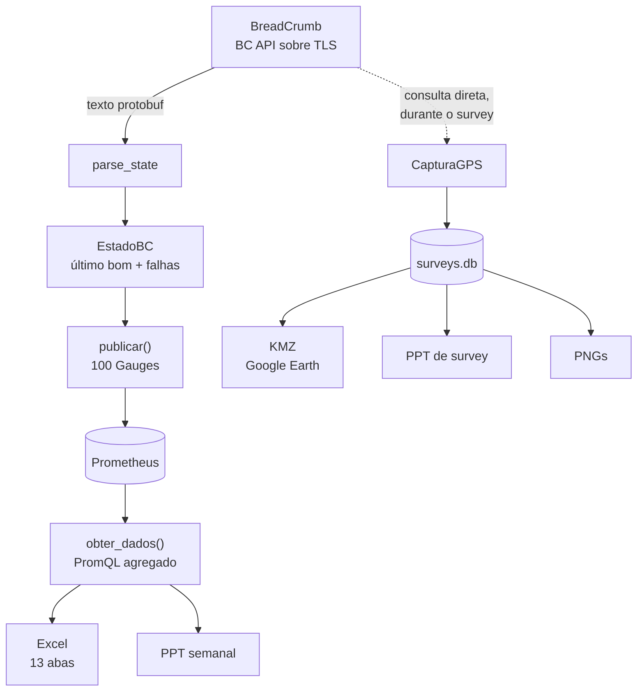
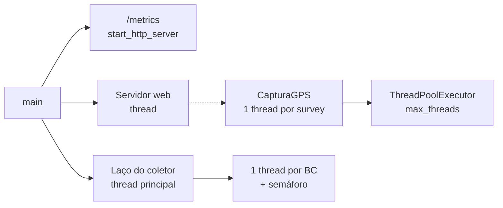
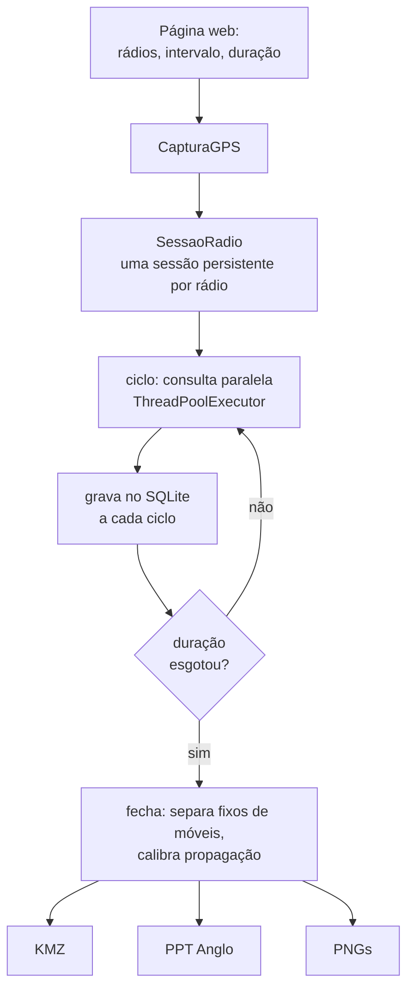

# Arquitetura

Como o `rajant_monitor.py` funciona por dentro: o caminho que um dado
percorre do rádio até o slide, cada peça, e por que ela está onde está.

Para *usar* o programa, leia o [README](README.md). Este documento é para
quem vai **mexer** nele.

---

## Índice

1. [O que é](#1-o-que-é)
2. [Decisões estruturantes](#2-decisões-estruturantes)
3. [O caminho do dado](#3-o-caminho-do-dado)
4. [Transporte e parsing](#4-transporte-e-parsing)
5. [Estado e confiabilidade](#5-estado-e-confiabilidade)
6. [Descoberta e coleta](#6-descoberta-e-coleta)
7. [As 100 métricas](#7-as-100-métricas)
8. [Modelo de execução](#8-modelo-de-execução)
9. [Armazenamento](#9-armazenamento)
10. [Survey: captura](#10-survey-captura)
11. [Survey: análise](#11-survey-análise)
12. [Survey: o mapa de calor](#12-survey-o-mapa-de-calor)
13. [KML e KMZ](#13-kml-e-kmz)
14. [Relatório Excel](#14-relatório-excel)
15. [Relatório PowerPoint](#15-relatório-powerpoint)
16. [Identidade Anglo](#16-identidade-anglo)
17. [Página web e endpoints](#17-página-web-e-endpoints)
18. [Grafana e painel próprio](#18-grafana-e-painel-próprio)
19. [Configuração completa](#19-configuração-completa)
20. [Linha de comando](#20-linha-de-comando)
21. [Testes](#21-testes)
22. [Build e distribuição](#22-build-e-distribuição)
23. [As invariantes](#23-as-invariantes)
24. [Limites conhecidos](#24-limites-conhecidos)
25. [Solução de problemas](#25-solução-de-problemas)
26. [Mapa do arquivo](#26-mapa-do-arquivo)
27. [Glossário](#27-glossário)

---

## 1. O que é

Um processo que faz três coisas ao mesmo tempo, sobre a mesma coleta, numa
malha Rajant BreadCrumb de ~150 nós em mina a céu aberto:

| papel | saída |
|---|---|
| **Exportador Prometheus** | 100 famílias de métrica em `/metrics` |
| **Gerador de relatórios** | Excel (13 abas) e PowerPoint, semanal e de survey |
| **Ferramenta de site survey** | captura ao vivo, KMZ para Google Earth, deck próprio |

### Números do código

| | |
|---|---|
| linhas | ~13.100 |
| funções no topo | 220 |
| métodos | 105 |
| classes | 7 |
| famílias de métrica | 100 |
| endpoints HTTP | 26 |
| tabelas SQLite | 3 |
| testes | 386, em 55 classes |
| comentários | 10% das linhas |

Os 10% de comentário não são enfeite: quase todos registram uma armadilha
concreta. A convenção é rígida — **comentário explica *por que*, não *o
quê***. Um comentário que descreve o código é ruído; um que registra o bug
evitado é o que impede a próxima pessoa de "simplificar" de volta.

---

## 2. Decisões estruturantes

### Por que um arquivo só

A rede da mina é isolada: sem PyPI, sem Docker, sem pipeline de deploy. O
que roda lá chega por pendrive ou cópia de arquivo. Um pacote com
`__init__.py`, dependências internas e ordem de importação é mais uma coisa
para dar errado no lugar onde ninguém pode depurar.

O custo é real — navegar é pior e o acoplamento é fácil demais. O que
segura isso são os 386 testes e as âncoras de seção (§26).

### Dependências

| pacote | para quê | crítico? |
|---|---|---|
| `rajant-api` | falar com os BCs | sim |
| `protobuf 4.23.4` | a `rajant-api` depende | sim |
| `prometheus_client` | expor `/metrics` | sim |
| `python-pptx` | gerar os decks | só relatório |
| `openpyxl` | gerar o Excel | só relatório |
| `matplotlib` | PNGs e raster do calor | só survey |
| `numpy` | grade do calor, agregações | só survey |
| `scipy` | `cKDTree` na interpolação | só survey |
| `lxml` | XML do PPTX | via python-pptx |

**Nada de framework web.** O servidor é `http.server` da biblioteca padrão
e o front é HTML/CSS/JS embutido no próprio arquivo. Rede isolada não baixa
bundle nem CDN.

### A armadilha da rajant-api

Ela declara três dependências e **só usa uma**:

```
grpcio == 1.56.2        declarada, NUNCA importada
grpcio-tools == 1.56.2  declarada, NUNCA importada
protobuf == 4.23.4      esta sim
```

Isso não é curiosidade: `grpcio 1.56.2` não tem wheel para Python 3.12+, e
instalar as dependências declaradas falha tentando compilar C++. Por isso:

```bash
pip install rajant-api --no-deps
pip install "protobuf==4.23.4"
```

E ela faz `from ssl import wrap_socket`, função **removida no Python 3.12**
(não na 3.13 — as duas dão o mesmo erro). O módulo instala um *shim*
compatível antes de importá-la. Consequência prática: `import rajant_api`
sozinho falha, `import rajant_monitor` funciona. O shim reproduz o
comportamento antigo **inclusive sem validar certificado**, que é o que a
`ssl.wrap_socket()` fazia e o que os BCs exigem, por usarem certificado
autoassinado.

---

## 3. O caminho do dado



Há **dois caminhos de leitura do rádio**, e eles não se misturam:

- O **coletor** roda em ciclo fixo, publica em métricas e alimenta os
  relatórios pelo Prometheus. É a série histórica.
- A **captura de survey** fala com os rádios *diretamente*, na hora, e grava
  no SQLite. Amostrar o cache do exportador daria a resolução do ciclo do
  exportador, não a que o survey pediu.

Quando a consulta direta falha, a amostra cai para o último estado do
exportador e é **marcada** (`fonte = 'cache'`). Ponto defasado e
identificado é melhor que buraco no trajeto; ponto defasado disfarçado de
medição é pior que os dois.

---

## 4. Transporte e parsing

A `rajant-api` devolve o `State` em **texto de protobuf**, não em objeto.
O parsing é por regex — com um detalhe que não é opcional.

### extrair_blocos() conta chaves

Regex não equilibra `{}`, e os blocos do State aninham: um `peer` dentro de
`radio` dentro de `wireless`. Extrair com regex ingênua pega o fechamento
errado e mistura campos de níveis diferentes. `extrair_blocos()` percorre
contando profundidade.

> `parse_state()` é a fronteira. Dali para dentro tudo é dicionário Python;
> nenhuma outra parte do programa sabe que existe protobuf.

O dicionário devolvido tem ~90 chaves, entre elas `gps_lat`, `gps_fix`,
`canal`, `freq`, `ch_busy`, `ch_rx`, `ch_tx`, `interf_pct`, `custo`,
`first_hop`, `good_peers`, `apt_master`, `bateria`, `cpu_pct`, `firmware`.

### Filtro de estado descoberto, não presumido

`_get_state_filtrado()` pede só os ramos `gps`, `wireless` e `system` —
puxar o State inteiro de 150 rádios a cada 10 s é desperdício de banda na
malha que se está medindo.

O nome do parâmetro mudou entre versões da biblioteca. Em vez de chutar, o
código **inspeciona a assinatura** na primeira chamada:

```python
for cand in ("stateFilterPath", "state_filter_path", "filterPath",
             "filter_path", "path", "paths", "messagePath"):
    if cand in ps: _FILTRO_ESTADO["param"] = cand
```

Sem filtro disponível, cai para o State inteiro — mais pesado, porém
correto. Descoberto uma vez por processo e guardado.

### Conversões que estavam erradas

A auditoria (`AUDITORIA_METRICAS.md`) corrigiu três conversões que passavam
despercebidas havia tempo:

| campo | erro | correto |
|---|---|---|
| **GPS** | tratado como grau decimal | é **NMEA** (`ggmm.mmmm`) — `nmea_para_graus()` |
| **SNR** | lido direto | derivado de sinal e ruído |
| **temperatura** | escala errada | com classe (`class_temp`) |

### Ping: uma chamada, não N

`ping_qualidade(ip, n=4)` faz **um** `ping -c 4` e extrai RTT médio e perda
da mesma saída. N chamadas de `ping_rtt()` custariam N processos; com 150
rádios por ciclo, isso decide se a coleta cabe no intervalo.

A perda de pacotes só existe porque **a BC API não a fornece**.

---

## 5. Estado e confiabilidade

Três classes guardam o que uma leitura isolada não sabe:

### EstadoBC

Último dado bom, timestamp e falhas consecutivas. Um BC **não fica offline
no primeiro timeout** — a malha tem perda, e sem isso o painel piscaria a
cada varredura. `falhas_limite` define quantas falhas seguidas derrubam;
`manter_s`, por quanto tempo o último dado bom ainda vale.

### JanelaDisponibilidade

Deque de `(timestamp, online)` com janelas deslizantes:

| janela | segundos |
|---|---|
| 1 h | 3.600 |
| 24 h | 86.400 |
| 7 d | 604.800 |

Metodologia BCE. As três são publicadas separadamente porque respondem
perguntas diferentes: 1 h é operação, 24 h é turno, 7 d é o relatório.

### CacheIPs

IPs já descobertos, persistidos em disco. Existe para sobreviver a reinício
com o seed fora do ar. Tem contrapartida — ressuscita endereço que saiu da
rede, mantendo equipamento fantasma na métrica —, e por isso pode ser
desligado (`[coleta] usar_cache = false`), o que faz sentido com lista fixa.

---

## 6. Descoberta e coleta

O `RajantCollector` parte dos *seeds* e caminha pelos peers, em lotes. Cada
ciclo dispara uma thread por BC, limitadas por semáforo (`max_threads`).

### Nó físico ≠ IP

Um BC com quatro rádios responde em quatro IPs. `_publicar_identidade()`
agrupa por identidade reportada, nesta ordem de confiabilidade:

1. `system.ipv4` — o IP que o próprio BC reporta, único por nó
2. o nome configurado
3. o IP consultado (nó ainda não identificado)

O IP reportado vem **primeiro** porque nome repetido na rede (config
duplicada) colapsaria nós distintos. Sem esse agrupamento, 150 BCs viram
600 na contagem.

**Guarda:** grupo com mais de `MAX_IFACES = 6` interfaces sugere colisão de
nome, não nó com muitos rádios. Nesse caso desagrupa e cada IP conta.

### Lista fechada é fechada

Com `descoberta = false`, o ciclo **não pode** reintroduzir peers pela porta
dos fundos:

```python
if peers and self.descoberta:
    ...adiciona os novos
```

É uma linha, e sem ela a configuração seria decorativa. Seed que não
responde **continua na lista**: um BC precisa seguir monitorado justamente
quando cai.

### Coleta acelerada dos móveis

`intervalo_moveis_segundos` roda um ciclo curto só com os equipamentos
móveis. Veículo muda de posição e de servidor o tempo todo; torre, não.

### Filtro por tag

`somente_com_tag = true` descarta quem responde mas não tem nome com
prefixo de frota (CA, PA, PF, TT, EH, ERM, ERB…). O descarte é **auditável**:
vai para o log e para a métrica `rajant_bc_sem_tag`. Se `prefixos_frota`
estiver vazio, o filtro se desliga sozinho em vez de descartar tudo.

---

## 7. As 100 métricas

Prefixo `rajant_`. Agrupadas como aparecem no código:

### Descoberta (4)
`cache_total` · `cache_online` · `seed_status` · `bc_sem_tag`

### Sistema (16)
`online` · `uptime_s` · `temperatura_c` · `temperatura_classe` ·
`bateria_pct` · `bateria_ma` · `bateria_carregando` · `bateria_temp_c` ·
`bateria_autonomia_min` · `bateria_recarga_min` · `boot_counter` ·
`reboot_needed` · `memoria_livre_kb` · `cpu_load_pct` · `bridge_ativa` ·
`apt_master`

### Disponibilidade (5)
`disponibilidade_1h_pct` · `disponibilidade_24h_pct` ·
`disponibilidade_7d_pct` · `falhas_consecutivas` · `ultima_coleta_ts`

### Rádio (24)
`radio_canal` · `radio_ruido_dbm` · `radio_ruido_classe` ·
`radio_txpower_dbm` · `radio_rx_bytes` · `radio_tx_bytes` ·
`radio_rx_pacotes` · `radio_tx_pacotes` · `radio_rx_mbps` ·
`radio_tx_mbps` · `radio_rx_pps` · `radio_tx_pps` · `radio_ch_active_ms` ·
`radio_ch_busy_ms` · `radio_ch_rx_ms` · `radio_ch_tx_ms` ·
`radio_busy_pct` · `radio_rx_pct` · `radio_tx_pct` · `radio_idle_pct` ·
`radio_interf_pct` · `radio_peers_ativos` · `radio_peers_total` ·
`radio_clientes`

### Peers (8) + good peers (1)
`peer_snr_db` · `peer_sinal_dbm` · `peer_rssi` · `peer_taxa_mbps` ·
`peer_custo` · `peer_ativo` · `first_hop_cost` · `bc_info` ·
`radio_good_peers` (peers com SNR > 30 dB, critério BCE)

### GPS e identidade (11)
`gps_lat` · `gps_lon` · `gps_fix` · `gps_vel_kmh` · `gps_rumo_graus` ·
`gps_satelites` · `gps_altitude_m` · `gps_precisao_h` · `bc_primario` ·
`bc_interfaces` · `nos_fisicos_total`

### Ping e topologia (3) + score (1)
`ping_rtt_ms` · `ping_ok` · `link_changes` · `mesh_score` (0–100)

### InstaMesh (7 + 8 substitutas)
`im_pkt_tx` · `im_pkt_rx` · `im_pkt_drop` · `im_floods_drop` ·
`im_arp_total` · `im_disc_sourced` · `im_disc_passed` ·
`im_source_floods_drop` · `im_pkt_multicast` · `im_tx_pps` · `im_rx_pps` ·
`im_drop_pps` · `im_perda_pct` · `im_floods_pps` · `im_arp_pps`

### Ethernet e alertas (12)
`eth_link` · `eth_apt_state` · `eth_rx_bytes` · `eth_tx_bytes` ·
`eth_rx_pacotes` · `eth_tx_pacotes` · `eth_rx_mbps` · `eth_tx_mbps` ·
`eth_peers` · `ap_clientes` · `best_radio_rate` · `alertas_ativos`

### A interferência é derivada, não medida

**A BC API não expõe varredura de espectro.** Isso foi verificado grepando
todos os 13 arquivos `.proto`, e há teste que **falha se algum passar a
expor**.

`radio_interf_pct` é derivada dos contadores de *airtime* 802.11:

```
interferência ≈ busy − rx − tx
```

O tempo que o meio esteve ocupado e não fomos nós. Calculada **só sobre
delta** entre leituras — os contadores são cumulativos desde o boot, e usar
o valor absoluto daria a média da vida do rádio, não a do período.

Isso não é analisador de espectro e não deve ser apresentado como tal.

---

## 8. Modelo de execução



Tudo é *thread*, nada é `async`. A carga é I/O de rede com timeout, e
`threading` com semáforo resolve sem contaminar o resto do código com
`await`.

**O teto de threads não é sobre o servidor.** 150 conexões simultâneas
derrubam a malha antes de derrubar o processo. O gargalo protegido é o
rádio.

### Sequência de subida

1. lê config, resolve seeds, monta prefixos de frota
2. `CacheIPs` (ou desligado)
3. `start_http_server(metrics_port)` — o `/metrics`
4. servidor de relatórios em thread (salvo `--sem-relatorios`)
5. banner no log com seeds, descoberta, cache, filtro, portas, intervalo
6. `RajantCollector` instanciado e publicado em `COLETOR_ATUAL["ref"]` —
   é isso que habilita a captura pela página web
7. laço: descoberta → ciclo → espera

---

## 9. Armazenamento

Três lugares, com propósitos distintos:

| onde | o quê | por quê |
|---|---|---|
| **Prometheus** | série temporal das métricas | histórico, alertas, Grafana |
| **`surveys.db`** (SQLite) | surveys, amostras, medições manuais | o survey precisa da amostra crua, não do agregado |
| **`cache_ips.json`** | IPs já vistos | sobreviver a reinício com seed fora |

### Esquema completo

```sql
CREATE TABLE survey (
    id           INTEGER PRIMARY KEY AUTOINCREMENT,
    nome         TEXT NOT NULL,
    inicio       REAL NOT NULL,
    fim          REAL,
    intervalo_s  INTEGER,
    radios       TEXT,    -- JSON: nomes selecionados
    alcance      REAL,    -- raio inicial das manchas, em metros
    n_amostras   INTEGER, -- contadores fechados junto com o survey,
    n_moveis     INTEGER, -- para o histórico não reprocessar as
    n_fixos      INTEGER, -- amostras a cada abertura da página
    intervalo_efetivo_s REAL,
    resumo       TEXT,    -- JSON: indicadores agregados
    calibracao   TEXT,    -- JSON: {banda: {A, n, rms, amostras, alcance_m}}
    criado_em    REAL NOT NULL
);

CREATE TABLE amostra (
    survey_id INTEGER NOT NULL REFERENCES survey(id) ON DELETE CASCADE,
    radio     TEXT NOT NULL,
    ts        REAL NOT NULL,
    lat REAL, lon REAL, vel REAL,
    snr REAL, sinal REAL, ruido REAL,
    rtt REAL, perda REAL,
    custo REAL, taxa REAL, vazao REAL,
    peers INTEGER, sats INTEGER, hdop REAL,
    banda TEXT,
    fonte TEXT,      -- 'direto' | 'cache'
    servidor TEXT,   -- BC que atendeu neste ponto
    interf REAL,     -- % de antena ocupada por transmissor alheio
    canal INTEGER
);
CREATE INDEX ix_amostra_survey ON amostra(survey_id);
CREATE INDEX ix_amostra_radio  ON amostra(survey_id, radio);

CREATE TABLE medicao_manual (
    id INTEGER PRIMARY KEY AUTOINCREMENT,
    survey_id INTEGER REFERENCES survey(id) ON DELETE CASCADE,
    tipo TEXT NOT NULL,   -- 'iperf' | 'trace'
    data TEXT, local TEXT, lat REAL, lon REAL, ...
);
```

Campos que merecem explicação:

- **`intervalo_efetivo_s`** — o intervalo *pedido* é intenção; o ciclo pode
  estourá-lo. O que descreve a resolução do trajeto é o que de fato
  aconteceu, e é esse que vai para o relatório.
- **`servidor`** — qual BC atendeu naquele ponto. Sem ele não dá para dizer
  *"esta área é servida pelo ERB-03"*, que é a frase que o survey existe
  para produzir, nem para detectar handover e ping-pong.
- **`fonte`** — `direto` ou `cache`. Rastreabilidade de procedência.
- **`n_amostras`, `n_moveis`, `n_fixos`** — fechados junto com o survey.
  Sem eles, a página do histórico reprocessaria todas as amostras a cada
  abertura.

**Migração** de banco antigo é feita com `ALTER TABLE` condicional na
abertura: `CREATE TABLE IF NOT EXISTS` não acrescenta coluna a tabela que já
existe. Foi assim que `fonte` e `intervalo_efetivo_s` entraram sem quebrar
banco em produção.

Gravação é **a cada ciclo**, não no fim: se o processo cair no meio de um
survey de 8 h, o que já foi medido continua valendo.

---

## 10. Survey: captura



### SessaoRadio

Mantém a conexão autenticada aberta entre ciclos. Reautenticar a cada
leitura, num intervalo curto, custa mais que a leitura. Rádio que falha
`falhas_para_pular` vezes seguidas é **abandonado pelo resto do survey** —
um rádio morto não pode segurar o ciclo dos outros.

As sessões seguram socket no rádio, então são fechadas no `finally`: mesmo
se o survey abortar no meio, o BC não fica com conexões penduradas.

### Modo contínuo

Pedindo intervalo **0**, o ciclo seguinte sai no instante em que o anterior
termina — sem espera. A cadência passa a ser só o tempo de ida e volta ao
rádio:

| intervalo | a 40 km/h, distância entre amostras |
|---|---|
| 60 s | ~660 m |
| 20 s | ~220 m |
| 1 s | ~11 m |

É a diferença entre pontilhado e rastro. Não é grátis: cada amostra é uma
ida e volta ao rádio **pela própria malha que se está medindo**.

O único mínimo é de 50 ms, e **não é freio de carga**: é proteção contra
laço vazio. Se todos os rádios falharem instantaneamente, sem ele o
processo giraria a 100% de CPU sem medir nada.

### O ping tem cadência própria

Posição e RF vêm do `get_state`, que é rápido. Latência e perda vêm do
ICMP — e o **ping do Windows não aceita intervalo**: `ping -n 4` espera
~1 s entre envios e custa ~3 s por rádio. Preso ao ciclo, impunha esse
piso também à posição, que é o que desenha o rastro. Medido com rádio
simulado: **3,15 s/ciclo → 0,30 s/ciclo**, ou 35 m → 3 m entre amostras a
40 km/h.

Nos ciclos sem ping, `rtt` e `perda` saem `None` — invariante 1 (§23).
Repetir a última leitura numa posição nova inventaria medição.

> **A armadilha que isso revelou:** o modo contínuo existia no backend e o
> campo da página tinha `min="5"`. Dava para configurar e **não dava para
> usar** — e nada no código acusava. Hoje o campo aceita 0 e há teste que
> falha se o `min` voltar.

E a cadência por rádio ainda não bastou. Em campo, com **159 rádios**, o
ciclo deu **46,3 s** — e como 46 s > `ping_a_cada_s`, todo rádio vivia
vencido: o ping voltava a ser de todos. Daí o **orçamento** de
`ping_max_por_ciclo` (padrão: o teto de threads), servindo os mais
atrasados primeiro. O custo do ping para de crescer com a frota; cada
rádio é pingado a cada *N/orçamento* ciclos.

O que o orçamento **não** resolve: o `get_state` de 159 rádios em 12
threads já custa ~4 s. Contínuo com a frota inteira é a ferramenta errada
— **selecione só os veículos do trajeto**.

O aviso da página trata "consultas/s" no contínuo como **teto**, não como
taxa — o ciclo se alonga sozinho pelo teto de threads.

### Ponto parado não entra no trajeto

Amostra com a mesma coordenada da anterior não vira ponto de trajeto (mas
conta como amostra). Sem isso, veículo parado acumularia centenas de pontos
sobrepostos.

### Fixo × móvel sai do dado

No fechamento, quem não se deslocou mais que ~30 m (`0.0003°`) vira "fixo".
**Pelo dado, não pelo nome**: um ERM rebocado é rota, e é isso que importa.

---

## 11. Survey: análise

As grandezas medidas e seus requisitos (Modular Mining):

| campo | rótulo | unidade | escala | requisito | melhor |
|---|---|---|---|---|---|
| `sinal` | RSSI | dBm | −90 … −55 | > −75 | alto |
| `snr` | SNR | dB | 5 … 45 | > 20 | alto |
| `ruido` | Ruído | dBm | −100 … −70 | < −85 | baixo |
| `rtt` | Latência | ms | 0 … 200 | < 100 | baixo |
| `perda` | Perda | % | 0 … 10 | < 2 | baixo |
| `interf` | Interferência | % | 0 … 60 | < 20 | baixo |

Interferência: 20% é onde o CSMA começa a atrasar o acesso ao meio de forma
perceptível; acima de 50% a banda útil despenca **mesmo com RSSI ótimo** —
é o caso que confunde a operação ("o sinal está cheio e a rede está lenta").

### Funções de análise

| função | o que produz |
|---|---|
| `survey_resumo` | agregados por grandeza: `pct_ok`, `p05`, mediana |
| `margem_requisito` | quanto sobra (ou falta) para o limiar |
| `espacamento_tipico` | distância mediana entre amostras consecutivas |
| `agregar_em_grade` | mediana por célula — tira o viés do equipamento parado |
| `zonas_problema` | manchas contíguas fora do requisito |
| `texto_zona` | a frase acionável da zona |
| `analisar_servidores` | cobertura por BC, handovers, ping-pong |
| `calibrar_propagacao` | ajusta `RSSI = A − 10·n·log10(d)` por banda |
| `contar_rede` | BCs por tipo, com e sem posição |
| `distribuicao` | % das amostras por faixa da escala |

### Zonas-problema

O que transforma "23% fora do requisito" em ação. Uma zona é uma mancha
contígua de células ruins; o texto sai por grandeza:

- sinal/SNR baixo e mancha **grande** → sistêmico, sugere repetidora
- mancha **pequena** → sugere ação pontual
- interferência sistêmica → **não** sugere mais rádio (piora), sugere canal

A grade é a **mediana do espaçamento entre amostras**, não um valor fixo:
grade mais fina que a amostragem fragmenta a mesma sombra em várias zonas.
Isso foi pego por teste próprio antes de chegar ao relatório.

### Calibração de propagação

Com as posições dos fixos e o RSSI medido, ajusta `A` e `n` por banda e
guarda `rms` e nº de amostras. Serve para estimar alcance — e a estimativa
**nunca** é desenhada junto com a medição sem distinção visual (§23).

---

## 12. Survey: o mapa de calor

A rota sai como **raster georreferenciado** (`GroundOverlay`), não como
linha. Cada amostra pinta um núcleo de raio limitado à sua volta; fora dele,
transparente.

**Isso não é superfície de cobertura.** Cobertura interpola valor sobre
terreno onde ninguém passou — afirma sinal em lugar não medido. Há teste
exigindo que a maior parte do raster continue transparente. A diferença
entre *"medi aqui e deu isto"* e *"acho que lá deve dar aquilo"* é o que
separa um laudo de um chute.

### Como é construído

```python
# para cada amostra, só a janela dela é tocada
w = exp(-d²/(2σ²));  w[d > raio] = 0
peso += w;  soma += w·valor;  wmax = max(wmax, w)
valor = soma/peso   onde peso > 0
alfa  = sqrt(wmax) · 0,9
```

Varrer a grade inteira por ponto seria O(pontos × n²) e um survey de horas
não terminaria.

### Três decisões que custaram depuração

Todas visíveis no Google Earth antes de serem entendidas:

**1. Só entra quem andou.** Rádio parado dá dezenas de amostras no mesmo
ponto: virava bola isolada e, como BC fixo enxerga o vizinho de perto, saía
**verde**. Eram as "bolas desconectadas" — e o verde que não batia com a
realidade da mina. Com a lista de fixos, exclui por ela; sem ela, separa
pelo deslocamento.

**2. Opacidade pelo núcleo mais forte, não pela soma.** Pela soma, a pilha
de amostras de um equipamento parado ficava sólida *e* puxava a referência
de opacidade para cima, apagando o rastro de quem andou.

**3. Raio acompanha o espaçamento** (0,9×, entre 25 e 150 m) e σ = raio/1,5.
Com σ = raio/2 o peso no meio do vão caía a ~0,25 e o rastro se partia mesmo
com os círculos se tocando — o colar de contas.

> **Limite físico, não de desenho:** com amostras a 200 m não existe faixa
> estreita *e* contínua. Ou contas separadas, ou borrão largo afirmando
> medição longe da estrada. O caminho é medir mais rápido.

---

## 13. KML e KMZ

### A ordem dos elementos importa

`_placemark()` existe por um motivo específico: o schema do KML exige

```
name → description → TimeStamp → styleUrl → geometria
```

Emitindo `styleUrl` antes de `description`, o Google Earth **descarta o
estilo em silêncio** e desenha tudo em branco. Foi um dia de depuração
achando que o problema era cor.

### Escape não é opcional

Um `<` não escapado em `"Fora do requisito — < 20 %"` quebra o XML **do
arquivo inteiro**. O bug passou pelos testes porque eles só cobriam campos
com `>`; hoje há teste que faz parse do XML para as grandezas "menor é
melhor" (rtt, perda, interferência, ruído).

### Estrutura do arquivo

```
doc.kml
  ├── Estilos (um por cor usada — 40 passos de gradiente)
  ├── [BreadCrumbs]        (opcional, kmz_com_equipamentos)
  ├── Aba: RSSI            ← visível
  │     ├── GroundOverlay "Calor — RSSI"
  │     ├── [Rotas]        (opcional, kmz_com_rotas)
  │     ├── Medições
  │     └── Fora do requisito
  ├── Aba: SNR             ← invisível
  ├── Aba: Ruído / Latência / Perda / Interferência
files/calor_<campo>.png
```

Uma aba por grandeza, **só a primeira visível**: ligadas juntas, os
overlays se cobrem e nada se lê.

**Cor:** gradiente contínuo de 40 passos (`PASSOS_COR`), vermelho → verde,
invertido para as grandezas "menor é melhor". As oito faixas fixas antigas
davam degrau — duas leituras de −74,9 e −75,1 dBm saíam em cores diferentes
e o traçado virava confete.

**Estilos órfãos:** só são emitidos os estilos das cores efetivamente
usadas, e há teste para estilo declarado e não referenciado (e vice-versa —
`styleUrl` apontando para estilo inexistente cai no padrão branco).

**Decimação:** um survey de 8 h com 150 rádios a 10 s dá ~430 mil pontos; o
Google Earth engasga. `_decimar()` reduz uniformemente preservando a ordem
temporal, e o passo real vai escrito na descrição.

---

## 14. Relatório Excel

Treze abas, geradas com `openpyxl` a partir da mesma estrutura que alimenta
o PPT:

| aba | conteúdo |
|---|---|
| Disponibilidade | por BC, nas três janelas |
| Série Diária | evolução no período |
| Throughput | vazão por BC e agregada |
| Canais & RF | canal, potência, ruído |
| Espectro por Canal | ocupação e ruído agregados |
| Links (Peers) | enlaces com SNR, taxa, custo |
| Ethernet | portas, link, APT, tráfego |
| Saúde BreadCrumbs | CPU, memória, temperatura, bateria |
| Rankings | top tráfego, top vizinhos |
| Categorias | por tipo de equipamento |
| Eventos | quedas, com início/fim/duração |
| Survey | amostras do survey do período |
| Inventário | todos os BCs, com identificação |

Os dois formatos leem **a mesma** estrutura de `obter_dados()`. Divergir
aqui produziria um Excel e um PPT que discordam sobre a mesma semana.

---

## 15. Relatório PowerPoint

### Os dois decks

| deck | origem | como gerar |
|---|---|---|
| **Semanal** | template PPTX do cliente, preenchido | aba Relatórios, `/gerar?fmt=pptx` |
| **Site Survey** | construído do zero por código | `--ppt-survey ID`, `/survey/ppt` |

Por padrão são **separados** (`survey_no_semanal = false`). O semanal não só
deixa de anexar o survey: ele **remove os slides de survey que vêm no
template**, senão ficariam em branco no arquivo. O botão do menu passa a
dizer *"5. Site Survey (relatório separado)"*.

### O semanal

Preenchido por âncoras, não por índice: `_slide_por_titulo()` localiza pelo
texto do título (robusto a reordenação), com índice como *fallback*. Tabelas
por cabeçalho (`_tabela_por_cabecalho`), cartões por rótulo
(`_txt_valor_do_cartao`).

Quatro slides são **gerados por código** e inseridos no lugar certo:

1. `4. Saúde da Mesh Rajant — Evolução Diária` (2 gráficos nativos)
2. `4. Saúde da Mesh Rajant — Links Críticos (SNR)` (10 piores enlaces)
3. `4. Saúde da Mesh Rajant — Ethernet e Quedas`
4. `4. Saúde da Mesh Rajant — Espectro por Canal` (gráfico + tabela)

Os gráficos são **nativos do PowerPoint** (`CategoryChartData`), não
imagens: quem receber o deck pode editar.

### A fronteira entre os dois

O que decide o que sai do semanal é o **título** do slide, não o texto dele.
Casar `"site survey"` em qualquer lugar levava junto o que só cita survey em
prosa — o subtítulo de *Links Críticos* diz "candidatos a realinhamento /
site survey", e o slide sumia.

E `_titulo_do_slide()` pega a caixa de texto mais alta **que não é botão**:
o ◂ MENU fica em 0,28" e o título em 0,32", ou seja, o botão é mais alto e
viraria "o título" de todo slide.

Mesmo raciocínio para *Espectro por Canal*: chamava-se "5. Site Survey — …"
e ia embora com a seção 5, mas os números vêm dos contadores do **exporter**.
É saúde da malha — virou seção 4.

### O deck de survey

Capa → Índice → Sumário → Zonas-Problema → uma página por grandeza e banda.
Cada página de grandeza tem:

- moldura à esquerda (mapa) — **onde**
- gráfico de distribuição à direita — **quanto**
- dois cartões: "Dentro do requisito" e "Pior 5%"
- **barra da escala de cores**, com o requisito marcado no ponto exato

A escala usa `cor_continua`, a **mesma** função que pinta o KMZ. Legenda
desenhada com gradiente próprio divergiria do mapa na primeira mudança de
paleta — e legenda que discorda do mapa é pior que legenda nenhuma.

### Molduras em vez de imagens

`imagens_no_ppt = false` (padrão) faz o deck sair com **molduras vazias**,
cada uma dizendo qual KMZ abrir e qual camada ligar para tirar o print no
Google Earth. É o caminho de quem quer satélite real no slide, que o PNG não
tem enquanto a rede da mina bloquear os tiles.

### Navegação

O índice é clicável e cada slide tem o botão de volta. Detalhe que custou:
**um botão do template carrega DOIS hyperlinks** — um na forma e outro
dentro do *run*. Clicando no texto, o PowerPoint usa o do run, que o
python-pptx não expõe. `_limpar_link_de_texto()` remove o `hlinkClick` do
`rPr` antes de retargetar a forma.

---

## 16. Identidade Anglo

Os dois decks saem na identidade Anglo American:

```python
azul   = 031795   # institucional: título, régua, fundo da capa
azul2  = 19328F   # preenchimento secundário
texto  = 1A1A1A
suave  = 5A6478
linha  = D6DAE3
fundo  = FFFFFF
cartao = F4F6FA
fonte  = Calibri
```

Extraída do arquivo do cliente, não inventada. Os logos ficam em `marca/`;
sem a pasta o deck sai **sem logo**, em vez de estourar.

O deck de survey nasce assim. O semanal **não** — ele vem de um template em
azul-escuro com conteúdo digitado à mão. Trocá-lo criaria dois templates
para manter em sincronia e jogaria fora o que já está escrito.

### A repintura

`aplicar_identidade_anglo()` repinta o deck **no fim da geração**, depois de
preenchido. Assim a passagem pega também o verde/âmbar/vermelho que o
relatório acabou de escrever e os slides técnicos gerados por código — uma
tabela de cores, dois produtores.

Isso só é seguro porque o template não deixa nada para herdar: **874 runs de
texto e todos com cor explícita**, master e layout sem forma nenhuma, fonte
já Calibri. Verificado no arquivo do cliente.

Dois detalhes que custaram teste:

**Branco depende do que ficou atrás.** Na capa o fundo vira azul e o título
segue branco; sobre um cartão que clareou, o mesmo branco tem de virar
escuro ou o texto some. A decisão é por **luminância do fundo novo**. E os
tons de status sobre fundo escuro voltam a ser os do próprio template, que
já tinham sido escolhidos para isso.

**Borda de célula não passa pelo python-pptx.** Ela mora em
`lnL/lnR/lnT/lnB` dentro do `tcPr`. Sem tratá-la no XML sobravam **1248
traços** azul-escuros riscando o fundo branco.

A régua só entra se não cruzar nada: o slide de "Próxima Semana" começa em
1,20" e não em 1,35" como os demais, e o template é editado pelo cliente.

---

## 17. Página web e endpoints

Duas portas: `metrics_port` (`/metrics`, para o Prometheus) e
`porta_relatorio` (a página, quatro abas: **Relatórios**, **Survey**,
**Histórico**, **Medições**).

Os 26 endpoints:

| grupo | endpoints |
|---|---|
| relatório | `/gerar` · `/api/q` · `/diagnostico` |
| inventário | `/bcs` · `/radios` |
| captura | `/captura/iniciar` · `/parar` · `/status` · `/ativas` · `/imagens` · `/kml` · `/kmz` |
| survey | `/surveys` · `/survey` · `/survey/ppt` · `/survey/kmz-todos` · `/survey/comparar` · `/survey/excluir` |
| medições | `/medicoes/listar` · `/adicionar` · `/excluir` · `/importar` · `/modelo` |
| perfis | `/perfis/salvar` · `/abrir` · `/excluir` |

**Perfis** são seleções salvas de equipamento (frota completa, cava
principal, só repetidoras), para não remontar a seleção a cada survey.

**Medições manuais** (iperf e trace) entram por formulário ou CSV — a BC API
não dá throughput fim-a-fim nem caminho, e esses números fazem parte do
laudo. Há `/medicoes/modelo` que devolve o CSV modelo.

---

## 18. Grafana e painel próprio

### Sete dashboards

| arquivo | título | painéis |
|---|---|---|
| `rajant-visao-geral.json` | 1 · Visão Geral da Malha | 22 |
| `rajant-rf.json` | 2 · Rádio e Espectro | 28 |
| `rajant-enlaces.json` | 3 · Enlaces da Malha | 19 |
| `rajant-ethernet.json` | 4 · Portas Ethernet | 20 |
| `rajant-saude.json` | 5 · Saúde dos BreadCrumbs | 34 |
| `rajant-coletor.json` | 6 · Operação do Coletor | 19 |
| `rajant-survey.json` | 7 · Site Survey Contínuo | 22 |

São **gerados** por `gerar_dashboards.py` e conferidos por
`validar_dashboards.py` — 164 painéis escritos à mão divergiriam das
métricas na primeira mudança. O validador checa que toda métrica referenciada
existe no exportador.

`provisioning-dashboards.yaml` põe os sete no Grafana sem clique.

### Painel HTML próprio

`painel/visao-geral.html` — dashboard sem dependência externa, para quando
não há Grafana. Zero CDN, zero build: abre como arquivo.

---

## 19. Configuração completa

`config.ini` é criado no primeiro uso com os padrões comentados.

### `[relatorio]` — 28 chaves

| chave | o que faz |
|---|---|
| `prometheus_url` | de onde vêm os dados dos relatórios |
| `porta_relatorio` | porta da página web |
| `meta_geral` / `meta_mesh` / `meta_backbone` | metas de disponibilidade |
| `limite_cpu` / `limite_temp` / `limite_latencia` / `limite_ruido` | limiares de alerta |
| `padrao_erb` / `padrao_erm` / `padrao_backbone` / `padrao_movel` | regex de classificação |
| `prefixos_frota` | prefixos válidos por tipo (CA, PA, PF, TT, EH, ERM, ERB…) |
| `perfil_*` | seleções salvas de equipamento |
| `template_ppt` | o template do semanal |
| `survey_kmz` | fundo georreferenciado |
| `fundo_local` + `fundo_bbox` | alternativa ao KMZ; a bbox é **obrigatória** |
| `painel_html` | caminho do painel próprio |
| `survey_no_semanal` | `true` volta ao deck único |
| `identidade_anglo` | `false` mantém o visual original do template |
| `kmz_com_rotas` | `true` acrescenta a linha ligando amostras |
| `kmz_com_equipamentos` | `true` devolve os alfinetes dos BCs |
| `imagens_no_ppt` | `false` = molduras vazias para colar print |
| `zonas_grade_m` | lado da célula na agregação |

### `[survey]` — 8 chaves

| chave | padrão | o que faz |
|---|---|---|
| `max_threads` | 12 | teto de consultas simultâneas |
| `timeout_s` | 6 | timeout por rádio |
| `min_intervalo_s` | 5 | piso do intervalo pedido pela página |
| `piso_continuo_s` | 0 | espera mínima no contínuo (0 = sem pausa) |
| `ping_a_cada_s` | 15 | cadência do ping, independente do ciclo |
| `ping_max_por_ciclo` | (teto de threads) | máximo de pings por ciclo |
| `falhas_para_pular` | 3 | desiste do rádio após N falhas |
| `usar_cache_fallback` | true | amostra do exportador quando a direta falha |

### `[coleta]`

| chave | o que faz |
|---|---|
| `intervalo_moveis_segundos` | ciclo curto só dos móveis |
| `descoberta` | `false` = só os IPs de `[rede] seeds` |
| `usar_cache` | `false` = não lê nem escreve o cache em disco |
| `somente_com_tag` | `true` = só publica nome com prefixo de frota |

---

## 20. Linha de comando

### Operação

| flag | o que faz |
|---|---|
| `--port` / `--metrics-port` / `--porta-relatorio` | portas |
| `--interval` | intervalo do ciclo |
| `--seed` | IPs iniciais |
| `--role` / `--password` | credenciais da BC API |
| `--sem-relatorios` | sobe só o exporter |
| `--debug` | log verboso |

### Diagnóstico

| flag | o que faz |
|---|---|
| `--dump-state IP` | salva o State bruto e sai — diagnóstico de parsing |
| `--diagnostico-eth` | foca na porta ethernet: blocos, campos e valores |
| `--testar-fundo` | diz qual fundo os mapas vão usar **e por quê** |

### Relatórios e survey

| flag | o que faz |
|---|---|
| `--gerar-relatorio` | gera e sai |
| `--demo` | dados sintéticos (carimbados como tal) |
| `--ppt-survey ID` | o deck exclusivo de survey |
| `--kml-do-survey ID` | KMZ de um survey do histórico |
| `--kmz-todos` | um KMZ por grandeza e banda, num ZIP |
| `--kml-campo` | grandeza que colore os pontos |
| `--bandas` | bandas do survey |
| `--survey-csv` | heatmaps a partir de CSV georreferenciado |
| `--survey-do-prometheus` | monta o CSV a partir das métricas já coletadas |
| `--survey-radio` / `--survey-passo` / `--survey-vel-min` / `--survey-grade-m` | recortes da extração |
| `--survey-fundo` / `--fundo-bbox` / `--survey-kmz` / `--kmz-fundo` | fundo dos mapas |
| `--cobertura-ptx` / `--cobertura-ganho` / `--cobertura-expoente` / `--raio-interp` | modelo de propagação |
| `--montar-template-survey` | acrescenta os slides-modelo ao template |

---

## 21. Testes

`teste_parser.py`: **375 testes em 53 classes**, rodando **sem rádio e sem a
`rajant_api`** (há um stub no topo). Roda em qualquer máquina, inclusive CI
sem acesso à malha.

Grupos de cobertura:

| área | classes |
|---|---|
| parser | `TestBlocoConfiguration`, `TestCamposInexistentes`, `TestInstaMesh`, `TestAPT`, `TestClientesAP`, `TestPeers`, `TestGPS`, `TestSistema`, `TestRadio` |
| publicação | `TestPublicar`, `TestCPUDerivada`, `TestRobustez` |
| coleta | `TestIntervaloMoveis`, `TestDescobertaEFiltro`, `TestSelecaoPorTag`, `TestSessaoRadio`, `TestFiltroDeEstado`, `TestCapturaDireta` |
| survey | `TestPersistenciaSurvey`, `TestResumoSurvey`, `TestCalibracao`, `TestZonasProblema`, `TestServidorPorAmostra`, `TestMargemEGrade`, `TestInterferencia`, `TestComparacao` |
| KML/KMZ | `TestKmlSurvey` (37), `TestTodosOsKmz`, `TestZipImagens`, `TestFundoEBbox` |
| PPT | `TestSlidesSurvey`, `TestSurveyNoPPT`, `TestDeckSurveyAnglo`, `TestIdentidadeAnglo`, `TestIdentidadeNoSemanal`, `TestMolduraParaColar`, `TestNavegacaoEAnalise`, `TestMapaDaRede` |
| separação dos decks | `TestSeparacaoDosRelatorios`, `TestTituloDoSlide`, `TestRemocaoDaSecaoDeSurvey`, `TestSlidesTecnicosNoSemanal` |
| web | `TestEndpointsSurvey`, `TestParametrosSurveyWeb`, `TestPainelHTML` |
| ambiente | `TestShimSslWrapSocket`, `TestConfigSurvey`, `TestMarcaDemo` |

### O que a suíte cobre além do óbvio

- parsing contra amostras reais de State
- conversões (SNR, GPS NMEA, temperatura) contra os `.proto`
- **ausência** de varredura de espectro nos `.proto` — falha se aparecer
- XML do KML: ordem dos elementos, escape, estilos sem órfão
- raster do calor: transparência fora do rastro, **cor na posição do BC
  fixo** especificamente
- repintura Anglo: contraste texto/fundo em **todos** os runs, links intactos
- separação dos dois relatórios, **nos dois sentidos** de cada chave

### Duas práticas

**Testes que fixam decisão revertida são reescritos, não apagados.** Houve
um `test_sem_heatmap_no_kmz` exigindo a *ausência* de heatmap, de quando o
polígono de cobertura foi removido a pedido. Quando o calor voltou — com
outro significado — o teste virou dois, cobrindo os dois lados.

**Teste que passa com o bug reintroduzido não é teste.** O teste da "bola
verde" passou por duas versões antes de prestar: olhar a média do quadro não
servia, porque o rastro do móvel tem área muito maior e afogava a bola. Só
pegou conferindo a transparência **na posição** do BC parado. Vale rodar a
mutação antes de confiar num teste novo.

---

## 22. Build e distribuição

`build/gerar_exe.bat` gera `rajant_monitor.exe` no Windows, em cinco passos
com log completo em `build/log_build.txt`.

Decisões que custaram:

**`python -m PyInstaller`, não `pyinstaller`.** Quando o pip cai em "user
installation", os executáveis vão para `…\AppData\Roaming\Python\PythonXX\
Scripts`, que normalmente **não está no PATH**. O comando some e o build
morre com "is not recognized", mesmo com o pyinstaller instalado.

**`--no-deps` em linha separada.** Juntar com o passo anterior faria o
`--no-deps` valer para o comando inteiro, e o matplotlib entraria sem
`packaging`, `pyparsing` e `pillow`. O erro só apareceria depois, ao gerar a
primeira imagem.

**A conferência importa `rajant_monitor`, não `rajant_api`.** Conferir com
`import rajant_api` acusa uma falha que não afeta o programa (§2).

**`--onedir`, não `--onefile`.** E o `.bat` copia para fora do exe o que é
editável sem recompilar: `painel/`, `marca/`, o template e o `config.ini`.

**A janela não fecha sozinha, nem no erro.** Quatro `exit /b 1` sem `pause`
faziam a janela sumir com a mensagem. E o passo do PyInstaller demora de 3 a
10 minutos em silêncio — o script avisa que isso é normal.

> **Sem compilação cruzada:** `.exe` de Windows só sai de máquina Windows.

`build/diagnostico.bat` e `diagnostico.py` coletam ambiente, versões e o
resultado dos imports para diagnóstico remoto.

---

## 23. As invariantes

Quatro regras atravessam o código. Cada uma existe porque a violação já
causou um problema real.

### 1. Nunca publicar 0 no lugar de "não medi"

Zero é indistinguível de "medido e deu zero". Campo sem medição vira `None`
e a série é **omitida**. Era o que fazia contador de erro de ethernet e CPU
parecerem saudáveis num painel inteiro.

### 2. Nada se afirma sobre a BC API sem conferir o `.proto`

A auditoria removeu **19 séries** que não tinham campo correspondente e
corrigiu conversões erradas havia tempo. Há teste que falha se um `.proto`
passar a expor varredura de espectro.

### 3. Mapa errado é pior que mapa sem fundo

A imagem de fundo é posicionada pelo retângulo **dela**, não pelo dos dados.
Sem georreferência, é recusada. Mapa esticado mente sobre distância.

### 4. Medição e estimativa nunca se misturam sem distinção visual

Sobrepor as duas na mesma imagem foi o que produziu a impressão de área
inteiramente aprovada onde havia buraco. Os mapas do survey têm **três
camadas que nunca se confundem**: medido, estimado, e o contorno.

---

## 24. Limites conhecidos

Não são bugs, e vão continuar assim até alguém decidir o contrário:

- **A BC API não expõe varredura de espectro.** A interferência é derivada
  de contadores de airtime. Não é analisador de espectro.
- **`sinal` é o RSSI do melhor enlace ativo**, não a média dos vizinhos.
  Descreve a qualidade da cobertura no ponto e por isso é **otimista por
  construção**: numa malha densa quase sempre há um vizinho bom. Se o mapa
  parecer verde demais, é aqui que se investiga.
- **Perda de pacotes vem de ping ICMP**, não da API.
- **Throughput fim-a-fim e traceroute são medição manual.** A API não os dá.
- **Sem tiles de satélite na rede da mina.** O fundo vem de um provedor só
  (`FUNDO_SERVICO`, ArcGIS World Imagery). Bloqueado ele, o PNG sai sem
  satélite — `--testar-fundo` diz isso e o diagnóstico sugere liberar o host.
  É por isso que o KMZ existe: o fundo entra no Google Earth, na máquina de
  quem abre.
- **Rastro fino e contínuo exige captura rápida.** Limite físico (§12).
- **`--onedir`:** o `config.ini`, o `surveys.db` e o cache são criados no
  diretório **atual**. Rodar o `.exe` de outra pasta espalha arquivo.

---

## 25. Solução de problemas

| sintoma | causa provável | onde olhar |
|---|---|---|
| `ImportError: cannot import name 'wrap_socket'` | importou `rajant_api` direto | importe `rajant_monitor` (§2) |
| `No module named 'google'` | falta o protobuf | `pip install "protobuf==4.23.4"` |
| `'pyinstaller' is not recognized` | Scripts fora do PATH | `python -m PyInstaller` (§22) |
| métrica sumida | campo sem medição | é o esperado — invariante 1 (§23) |
| 150 BCs viram 600 | agrupamento de nó físico | `_publicar_identidade` (§6) |
| rota toda branca no Google Earth | ordem dos elementos no KML | `_placemark` (§13) |
| KMZ vazio / XML quebrado | `<` não escapado | `_esc` (§13) |
| mapa "todo verde" | rádio parado no calor, ou `sinal` = melhor enlace | §12 e §24 |
| bolas desconectadas | espaçamento maior que o raio | intervalo 0 na página (§10) |
| contínuo ainda espaçado | ping preso ao ciclo | `ping_a_cada_s` (§10) |
| ciclo de dezenas de s | frota inteira selecionada | selecione só o trajeto (§10) |
| PPT sem os slides de survey | é o padrão | `survey_no_semanal = true` (§15) |
| deck sem logo | falta a pasta `marca/` | §16 |
| PNG sem satélite | provedor bloqueado | `--testar-fundo` (§24) |
| botão do menu não navega | hyperlink no run | `_limpar_link_de_texto` (§15) |

---

## 26. Mapa do arquivo

As posições mudam a cada alteração; **use os nomes, não as linhas**. A ordem
é esta:

```
config, cache, logging, métricas          →  CacheIPs
disponibilidade e estado                  →  JanelaDisponibilidade, EstadoBC
helpers e parser                          →  extrair_blocos, parse_state
ping, publicação                          →  ping_qualidade, publicar
coletor                                   →  RajantCollector
relatório Excel                           →  Prometheus, obter_dados
preenchimento do PPT                      →  gerar_ppt, _slides_tecnicos
heatmaps de CSV, leitura de KMZ           →  ler_kmz
KMZ e KML do survey                       →  gerar_kml_survey, _calor_da_rota
persistência dos surveys                  →  survey_criar, amostras_gravar
medições manuais, seleção por tag
fundo de satélite, mapas do survey
captura ao vivo                           →  SessaoRadio, CapturaGPS
identidade Anglo                          →  ANGLO, slide_anglo, ppt_survey_anglo
identidade Anglo no semanal               →  aplicar_identidade_anglo
servidor web                              →  criar_handler
```

Essa ordem é, na prática, o desenho dos módulos caso o arquivo venha a ser
dividido um dia.

---

## 27. Glossário

| termo | o que é |
|---|---|
| **BreadCrumb (BC)** | o rádio Rajant; um nó da malha |
| **BC API** | a API dos BreadCrumbs, sobre TLS, com State em protobuf |
| **InstaMesh** | o protocolo de roteamento da Rajant |
| **peer** | vizinho de rádio de um BC |
| **custo** | métrica do InstaMesh para escolher rota (menor = melhor) |
| **APT** | Auto-Provisioned Trunking, na porta ethernet |
| **seed** | IP inicial de onde a descoberta parte |
| **ERB / ERM** | estação repetidora fixa / móvel |
| **CA / PA / PF / TT / EH** | prefixos de frota (caminhão, pá, perfuratriz, trator, escavadeira) |
| **survey** | levantamento de campo: percorrer medindo |
| **RSSI** | intensidade do sinal recebido, em dBm |
| **SNR** | relação sinal/ruído, em dB |
| **noise floor** | ruído de fundo do canal, em dBm |
| **airtime** | tempo de antena ocupado; base da interferência derivada |
| **handover** | troca do BC que atende um móvel |
| **ping-pong** | handover que oscila entre dois BCs |
| **zona-problema** | mancha contígua de células fora do requisito |
| **GroundOverlay** | imagem georreferenciada no KML |
| **LatLonBox** | o retângulo geográfico que posiciona um GroundOverlay |
